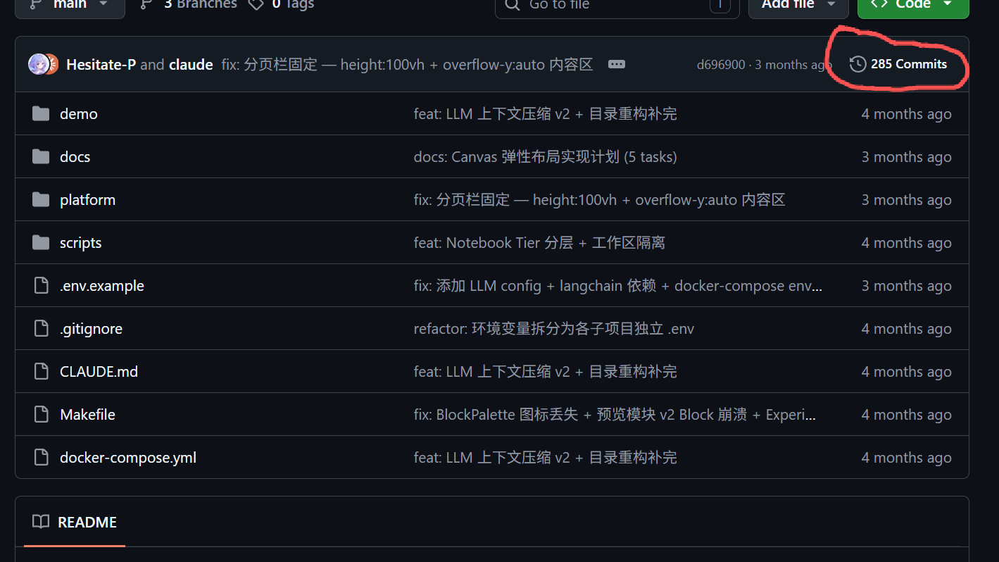
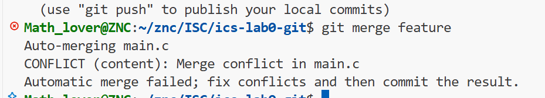
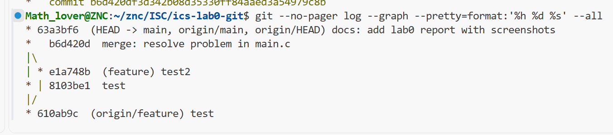

# ICS 2026 Fall — Lab0: GitLab 实验报告

| | |
|---|---|
| **姓名** | 邹柠灿 |
| **学号** | 26303050167 |
| **日期** | 2026 年 9 月 17 日 |
| **仓库地址** | https://github.com/zouningcan/ics-lab0-git |

---

## 一、文档问题回答

### 1.1 你之前有过多人协同开发的经历吗？如果有，你们是使用什么方式分工协作的？

有。2026 年 5 月我与好友（也是队友）两人协作开发了一个教学平台，从建仓当天即参与，历时约两周。项目是面向 CNN 水印检测课程的教学系统，包含学生端演示（Vue 3 + FastAPI + JupyterHub）和教师端平台（实验编辑器 + 班级管理），全程使用 Git 协作，两人累计提交 **285 次**。

> 该项目仓库为**私有仓库**，且涉及合作企业的内部内容，因此不提供仓库链接。以下描述均基于我在该项目中的实际参与经历。



**分工方式**：按功能模块划分，尽量让两人的工作区域不重叠。

- 我负责**前端渲染组件与安全加固**：MarkdownBlock 渲染、KaTeX 公式支持、P0 新渲染器（卷积演示 ConvolutionDemo、网络结构图 NetworkArchitecture、SRM 滤波器可视化），以及 XSS 防护（DOMPurify 转义、iframe sandbox 属性）和班级管理系统；
- 另一位同学负责**实验编辑器的布局系统**：CSS Grid 画布定位、网格吸附、Canvas WYSIWYG 编辑，以及 AI 对话面板 ChatPanel。

**协作机制**：我们约定了一套明确的规范。

- **分支隔离** —— 所有改动都从 `main` 创建 `feature/<描述>` 分支进行，不直接向 `main` 提交。实际使用过的分支包括 `feature/chatbot-experiment-generator`、`feature/jupyter`、`feature/user-management` 等；
- **提交规范** —— 使用 Conventional Commits 前缀配合中文描述，例如 `fix: KaTeX error handler HTML 转义，防止 DOMPurify 绕过`、`feat: P0 新渲染器 — ConvolutionDemo + NetworkArchitecture + SRMFilterViewer + KaTeX`；
- **定期同步主干** —— 开发过程中频繁执行 `Merge branch 'main' into feature/xxx`，把主干的改动及时并入自己的分支，而不是等到开发末期一次性合并；
- **合并保留历史** —— 统一使用 `git merge` 生成合并提交，不用 squash 或 rebase，以保证每个人的工作痕迹都留在历史上。

**遇到的困难**：尽管按模块做了分工，两人同时改动前端相关代码时仍会产生摩擦。我们的应对方式是**频繁地把主干改动同步进各自的分支**，避免差异积压到开发末期；即便如此，合并后偶尔仍会出现类型错误或行为不一致，需要额外提交来修复（例如提交记录中的 `fix: 修复合并后类型错误 + 预览路由 + 默认网格位置`）。

这段经历让我体会到，多人协作真正的难点不在"能不能合并代码"，而在于**提前约定好边界**——分支怎么命名、什么时候提交、冲突时以哪边的实现为准。没有这些约定，工具本身救不了失控的协作。

### 1.2 思考一下，Git 为什么要设计"暂存-提交"两个步骤？

核心是**提交粒度的控制权**。若只有一步，一次提交就等于工作区的全部改动；而实际开发中一次工作往往混杂着多件不相关的事（修 bug、改错别字、新功能开个头），打包提交会让历史无法单独回退——将来想只回退"那个 bug 修复"时，会发现它和错别字、半成品死死绑在一起。

暂存区把「我改了哪些文件」和「我要记录哪些改动」解耦，让每次提交对应一件完整的事。同时它在两步之间形成了一个**审查窗口**：`git diff --staged` 用来确认"这次到底提交什么"，而 `git restore --staged` 的存在说明暂存是可逆的、提交才是落定的——Git 把不可逆的那一步尽量往后推。

本次实验中我实际用到了这一点：解决冲突后，我用 `git add main.c` 告诉 Git"该文件的冲突已处理完毕"，再用 `git commit` 落定合并。**若只有一步，"标记冲突已解决"和"记录这次合并"这两个语义就无处安放。**

### 1.3 `git branch` 和 `git branch -a` 的区别是什么？

区别在于**是否显示远程分支**（`-a` 即 `--all`）。我在自己的仓库中实际执行：

```
$ git branch                    $ git branch -a
  feature                         feature
* main                          * main
                                  remotes/origin/HEAD -> origin/main
                                  remotes/origin/feature
                                  remotes/origin/main
```

`git branch` 只列出**本地分支**，行首 `*` 标记当前所在分支。`git branch -a` 额外列出 `remotes/origin/...` 形式的**远程跟踪分支**（remote-tracking branch）——记录"上次与远程通信时，远程仓库各分支指向哪里"，其中 `remotes/origin/HEAD -> origin/main` 表示远程默认分支是 `main`。

实际意义：远程跟踪分支是了解远程仓库状况的窗口。同事推了一个新分支上去，用 `git branch` 看不到，必须用 `-a` 才能发现。本次实验中我把 `feature` 推送到远程后，`git branch -a` 就多出了 `remotes/origin/feature` 这一行。

---

## 二、文章阅读与思考

### 2.1 《Commit message 和 Change log 编写指南》（阮一峰）

文章主张 Commit message 不应随手乱写，而应格式化，好处有三：便于快速浏览历史、便于按关键字过滤查找、可由提交自动生成 Change log。介绍目前最通用的 **Angular 规范**：

```
<type>(<scope>): <subject>
// 空一行
<body>
// 空一行
<footer>
```

Header 必需，任何一行不超过 72 字符。`type` 限 7 种：`feat`（新功能）、`fix`（修 bug）、`docs`（文档）、`style`（格式）、`refactor`（重构）、`test`（测试）、`chore`（构建/工具），其中 `feat` 和 `fix` 必进 Change log。`subject` 要求动词开头、第一人称现在时、首字母小写、结尾不加句号。Footer 用于标注 `BREAKING CHANGE:` 或关闭 issue（`Closes #234`）。文末介绍了 Commitizen、validate-commit-msg、conventional-changelog 三个配套工具。

**我的体会**：我第一次提交写的是 `feat: compleate main.c TODO`，type 用对了，但 `complete` 拼错了，直到后来查看 `git log` 才发现。这让我意识到 **Commit message 一旦提交就写进历史，修改要 `--amend` 重写，代价很高**。如果当时用了 validate-commit-msg 这类工具，错误会在提交那一刻就被拦下。

### 2.2 《Gitflow 使用规范》

文章介绍一套基于分支的协作管理策略，核心是**让不同分支各司其职**，定义了五种关键分支：

- **`master`** — 与线上运行版本一致，保证最高稳定性，每次新 commit 后立即打 tag（永久分支）
- **`develop`** — 开发主线，第一时间从 master 分离出来（永久分支）
- **`feature`** — 一个新功能对应一个分支，从 develop 创建，完成后合并回 develop 并删除（临时分支）
- **`release` / `bugfix`** — 提测阶段使用，从 develop 创建，修复测试环境 bug（临时分支）
- **`hotfix`** — 线上紧急 bug，直接从 master 或出问题的 tag 创建，修完合并到 master 和 develop（临时分支）

贯穿全文的原则是**「从哪里来，最后回到哪里去」**：develop 从 master 创建，迭代完再合回 master；feature 从 develop 创建，完成后合回 develop。合并 feature、release、hotfix 时都建议用 `--no-ff` 禁用快进，以保留分支存在过的痕迹。文末给出了命令示例，以及用 `git-flow` 扩展库把这套流程命令化的方法。

**我的体会**：本次实验"建 `feature` → 开发 → 合并回 `main`"的过程，正是 Gitflow 中 `feature → develop` 这一环的缩影。虽然 Lab0 只有单个功能、用不上完整五分支体系，但**「一个分支只做一件事，做完就合并回去」**这个思路已能显著降低混乱——如果我把所有改动都堆在 main 上，就不会有机会真正理解合并与冲突了。

### 2.3 谈谈你对"为什么要学习 Git"这个问题的理解

**第一层是「自救」。** 版本控制最朴素的价值是让人**敢于修改**。没有它，改错了只能靠记忆重写，重构一次要备份出 `student_old.h`、`student_old_v2.h` 一堆文件。有了 Git，任何一次提交都是可回去的存档点，试错成本接近零——**而这直接决定了一个人敢不敢去尝试更好的写法。**

**第二层是「协作」。** 文档开篇假设的场景——和同学同时改了同一个文件，只能逐行人肉对比——是很多人的真实痛点。Git 用分支把"各写各的"和"合并到一起"分开，每个人在自己的分支上自由开发，最后由 merge 负责汇总。Gitflow 则进一步说明：当团队规模变大，还需要靠分支规范来明确"谁在哪个分支上做什么"。**Git 提供机制，规范是在机制之上长出来的秩序。**

**第三层是「表达」。** 这是 Commit message 规范那篇文章给我的启发：提交历史不只是给自己看的备忘录，它是一份**写给未来的文档**。半年后回来查"这个功能为什么这么改"，`git log` 和 `git blame` 是唯一能回答的地方。格式化的提交信息让这份文档可以被机器解析，进而自动生成 Change log、自动关联 issue——**你把信息写规范的每一分努力，日后都会以可检索、可自动化的形式回报你。**

而"为什么要学"最现实的答案是：**这门课后续每一个 Lab，流程都是「用模板建仓库 → clone → 写代码 → commit → push」。** Git 不是 Lab0 的内容，而是完成 Lab1、Lab2、Lab3 的**工具**。现在把基本操作和分支模型练熟，后面才能把精力放在真正的系统知识上。

---

## 三、实验步骤

### 3.1 用模板仓库创建个人仓库

按文档要求使用 **Use this template** 而非 fork（fork 会丢失自动评分 workflow）：打开模板仓库 → 点击 **Use this template** → **Create a new repository** → 仓库名填 `ics-lab0-git` → 可见性选 **Public**（保证助教可访问检查）。

创建后验证 workflow 是否正确继承：

```bash
$ gh api repos/zouningcan/ics-lab0-git/contents/.github/workflows --jq '.[].name'
classroom.yml
```

确认 `classroom.yml` 存在，说明自动评分配置已正确带入。

### 3.2 完成 main.c 的 TODO 并通过自动评分

```bash
$ git clone git@github.com:zouningcan/ics-lab0-git.git
```

初始 `main.c` 中 `printf("Hello, world!\n");` 即为待完成的 TODO，修改该字符串后提交：

```bash
$ git add main.c
$ git commit -m "feat: compleate main.c TODO"
$ git push
```

**自动评分**：workflow 每次 push 自动触发，编译运行后将输出与原始字符串 `Hello, world!` 比对——**必须不同**才判定通过。修改前后对比：

| 提交 | 程序输出 | 评分 |
|---|---|---|
| Initial commit（未修改） | `Hello, world!` | **0 / 100** |
| `feat: compleate main.c TODO` | `hajimi` | **100 / 100** |

（注：提交信息中 `compleate` 为笔误，正确拼写应为 `complete`。此处保留原样以与仓库实际提交记录一致，相关反思见 2.1 节。）

### 3.3 分支管理与合并冲突

目标是让 `main` 和 `feature` 修改 `main.c` 的**同一行**，使合并时必然产生冲突。

```bash
$ git switch -c feature          # 创建并切换到 feature 分支
# 修改 main.c 的 printf 行
$ git add main.c && git commit -m "test2"

$ git switch main                # 切回 main
# 修改 main.c 的同一行
$ git add main.c && git commit -m "test"

$ git merge feature
Auto-merging main.c
CONFLICT (content): Merge conflict in main.c
Automatic merge failed; fix conflicts and then commit the result.
```



打开 `main.c`，Git 用冲突标记把两个版本都写进了文件：

```c
#include <stdio.h>

int main()
{
    // @TODO: print a sentence you want.
<<<<<<< HEAD
    printf("hajimi2\n");
=======
    printf("hajimi3\n");
>>>>>>> feature
}
```

`<<<<<<< HEAD` 到 `=======` 之间是当前分支（main）的版本，`=======` 到 `>>>>>>> feature` 之间是待合并分支（feature）的版本。

手工编辑该文件，删除三行冲突标记并保留所需内容后：

```bash
$ git add main.c                                    # 标记冲突已解决
$ git commit -m "merge: resolve problem in main.c"
$ git push
```

验证结果是一次真正的合并提交（而非快进）：

```bash
$ git log --graph --pretty=format:'%h %d %s' --all
*   b6d420d  (HEAD -> main, origin/main) merge: resolve problem in main.c
|\
| * e1a748b  (feature) test2
* | 8103be1  test
|/
* 610ab9c  (origin/feature) test
* 1b48340  feat: compleate main.c TODO
* a711b72  Initial commit
```

图中的 `|\` 与 `|/` 表明 `b6d420d` 拥有**两个父提交**（`8103be1` 和 `e1a748b`），是一次真正的合并提交。



> **补充说明**：我最初只在 `feature` 分支上做了提交，`main` 分支没有独立提交，因此 `git merge feature` 直接快进（`Fast-forward`），`main` 只是被平移到了 `feature` 的位置。这让我直观理解了冲突产生的**必要条件：两个分支必须从同一基点各自前进，且修改了同一位置**。随后在 `main` 上补做一次提交，再次合并时冲突如期出现。

### 3.4 提交实验报告

将本报告（`report.md`）及截图（`images/` 目录）一并提交至 `main` 分支：

```bash
$ git add report.md images/
$ git commit -m "docs: add lab0 report"
$ git push
```

最终在 E-Learning 平台提交仓库链接：https://github.com/zouningcan/ics-lab0-git

---

## 四、建议

### 建议一：自动评分脚本建议增加「退出码」与「非空输出」校验

**问题**：`classroom.yml` 的判分逻辑最终只做一次字符串比对——只要 `./main` 的输出与 `Hello, world!\n` **不同**即判 PASS。但脚本既没有检查程序的退出码，也没有检查输出是否为空，因此存在两类**假阳性**。

我把 workflow 中的判分脚本原样复刻到本机，实测结果如下：

| 测试程序 | 退出码 | 输出字节数 | 现脚本判定 | 合理判定 |
|---|---|---|---|---|
| 输出前发生段错误（`*(int*)0 = 1;`） | 139 (SIGSEGV) | 0 | **PASS** ❌ | FAIL |
| 空程序（`int main() { return 0; }`） | 0 | 0 | **PASS** ❌ | FAIL |

也就是说，**一个写崩了、或者干脆什么都不干的程序，同样能拿到这 50 分**。虽然作业说明中明确"程序的正确性不纳入计分，有修改即可"，但上述两种提交实际上并没有完成"填入一个字符串"这一要求——判定漏洞让"没做任务"和"做对了"拿到了相同的分数。

**建议**：在 `cmp` 之前补上两行校验，改动很小：

```bash
./main > .grader-stdout 2>/dev/null
if [ $? -ne 0 ]; then printf 'FAIL'; exit 0; fi              # 新增：退出码校验
if [ ! -s .grader-stdout ]; then printf 'FAIL'; exit 0; fi   # 新增：非空校验
printf 'Hello, world!\n' > .grader-expected
if cmp -s .grader-expected .grader-stdout; then
  printf 'FAIL'
else
  printf 'PASS'
fi
```

经实测验证，加上这两行后上述两个用例都被正确判为 FAIL，而正常修改 `printf` 内容的提交仍判 PASS（我在本地用自己仓库的 `main.c` 一并回归测试过）。

### 建议二：在模板仓库中加入基础 Git Hook

本次作业要求每人都制造并解决一次合并冲突，而**忘记删除 `<<<<<<<` 标记就提交**是极常见的学生失误——这样的代码根本编译不过，但要等到 push 之后由云端 workflow 才暴露，反馈链条很长。

我自己也踩了另一个坑：第一次提交把 `complete` 拼成了 `compleate`（见 2.1 节），而 commit message 一旦提交就要靠 `--amend` 改写历史，代价很高。

**建议**在模板仓库内预置两个 hook 示例，只需一行 `git config core.hooksPath .githooks` 即可生效：

```sh
# .githooks/pre-commit —— 拦截未解决的冲突标记
#!/bin/sh
files=$(git diff --cached --name-only --diff-filter=ACM)
if [ -n "$files" ] && echo "$files" | xargs grep -lE '^(<<<<<<< |>>>>>>> )' 2>/dev/null; then
    echo "❌ 暂存区文件存在未解决的冲突标记，请先处理"; exit 1
fi
```

```sh
# .githooks/commit-msg —— 拒绝空信息，并提示规范格式
#!/bin/sh
msg=$(cat "$1")
[ -n "$(echo "$msg" | tr -d '[:space:]')" ] || { echo "❌ commit message 不能为空"; exit 1; }
echo "$msg" | grep -qE '^(feat|fix|docs|style|refactor|test|chore|merge)(\(.+\))?: .+' \
    || echo "⚠️  建议使用 Conventional Commits 格式：<type>: <subject>"
```

**为什么值得做**：这两类错误的共同点是——**它们都能在"提交"这一瞬间被本地拦截，却要等到云端评分才被发现**。把校验前移，既省下学生的等待时间，也省下助教排查的成本。这恰好呼应了 Commit message 规范那篇文章的核心思路：**不要依赖人的自觉，而要用工具把规范固化到流程里**。

### 建议三：任务 4 的分支与冲突也可以自动化校验

目前 20 分的分支/冲突部分完全依赖报告截图，而截图是可以事后重放补拍的。但整个仓库本身就是 git 仓库，这部分其实可以直接从提交历史中自动验证：

```bash
# 存在至少一个真正的合并提交（两个父提交）
git log --merges --format='%P' | awk 'NF==2' | grep -q . || echo "FAIL: 未发现合并提交"
# 存在 feature 分支
git branch -a --format='%(refname:short)' | grep -q '^feature$' || echo "FAIL: 未发现 feature 分支"
```

这样既减轻助教逐份核对截图的工作量，也让评分标准更客观——**能用机器验证的事情，就不必依赖人的诚信**。当然，截图仍有价值：它能反映"冲突长什么样"这一学习过程，只是不宜作为唯一的评分依据。

---

*本报告使用 Markdown 编写，截图存放于 `images/` 目录。*
